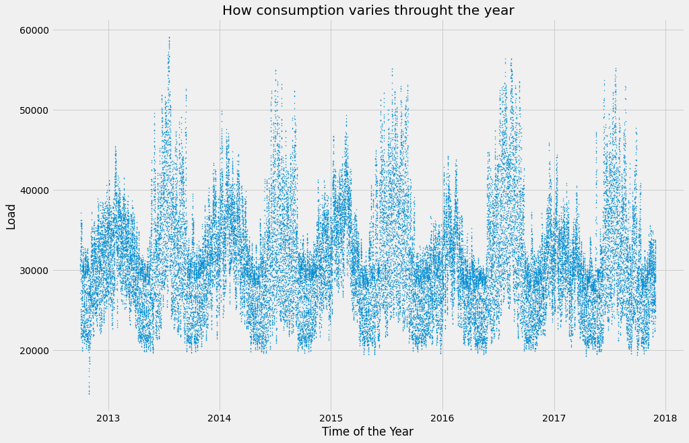

# Hourly Electric Load Forecast for PJMI - Pittsburgh, USA - For 7 Days

Datasets used - 
- [Hourly Electric Load Data](https://www.kaggle.com/robikscube/hourly-energy-consumption)
- [Hourly Temperature Data](https://www.kaggle.com/selfishgene/historical-hourly-weather-data)

## Hourly Electric Load Data
PJM Interconnection LLC (PJM) is a regional transmission organization (RTO) in the United States. It is part of the Eastern Interconnection grid operating an electric transmission system serving all or parts of Delaware, Illinois, Indiana, Kentucky, Maryland, Michigan, New Jersey, North Carolina, Ohio, Pennsylvania, Tennessee, Virginia, West Virginia, and the District of Columbia.

The hourly power consumption data comes from PJM's website and are in megawatts (MW).

The regions have changed over the years so data may only appear for certain dates per region.
## Hourly Temperature Data
The dataset contains ~5 years of high temporal resolution (hourly measurements) data of various weather attributes, such as temperature, humidity, air pressure, etc.

This data is available for 30 US and Canadian Cities, as well as 6 Israeli cities.
I've organized the data according to a common time axis for easy use.
Each attribute has it's own file and is organized such that the rows are the time axis (it's the same time axis for all files), and the columns are the different cities (it's the same city ordering for all files as well).
Additionally, for each city we also have the country, latitude and longitude information in a separate file.

## Abstract
- Short term electric load modeling and forecasting.
- Demand Side Management (DSM) with beyond when and how much demand will be and - why is electricity being consumed?
- Factors driving the fluctuations of the electric load at a particular time period.
- Model hourly demand and investigate causality of the consumption of electric energy
- Terms - Load forecasting, load management, load modeling, multiple linear regression
- Both the datasets combined on common datetime attribute
-Resulting dataset has 45250 rows, containing hourly data for years 2012-2017 of which data for the years 2012-2016 is used for training and data for the year 2017 is used for forecasting

## Multiple Linear Regression in the Context
- Used to model relationship between several independent and a dependent variable as a linear function
- Y = b0 + b1x1 + b2x2 + e where Y is dependent variable, x1, x2 are independent variables, b are parameters to estimate and e is error term
- Coefficients of independent variables represent how Y will change when that specific independent variable changes while all other variables are held constant

## Looking at the data

### How the load changes throught the year

### Existing Variables
- In this context, independent variable - electric load in MegaWatts, dependent variables temperature, time of the year
- To account for the time of the day, time of the month, affect of human activities on the elecric load following dummy variables are created - hour of the day, month of the year

### Interaction Variables

- Diagnostic statistics - MAE, STDAE, MAPE, STDAPE
- Electric load and hourly temperature history - 
- Training sample - years 2005-2007
- Testing sample - year 2008

