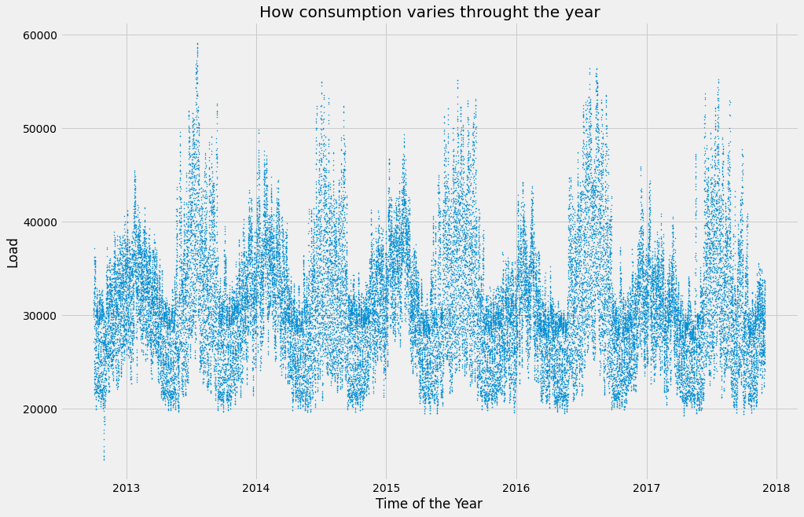

# Hourly Electric Load Forecast for PJMI - Pittsburgh, USA - For 7 Days

Datasets used - 
- [Hourly Electric Load Data](https://www.kaggle.com/robikscube/hourly-energy-consumption)
- [Hourly Temperature Data](https://www.kaggle.com/selfishgene/historical-hourly-weather-data)

## Hourly Electric Load Data
PJM Interconnection LLC (PJM) is a regional transmission organization (RTO) in the United States. It is part of the Eastern Interconnection grid operating an electric transmission system serving all or parts of Delaware, Illinois, Indiana, Kentucky, Maryland, Michigan, New Jersey, North Carolina, Ohio, Pennsylvania, Tennessee, Virginia, West Virginia, and the District of Columbia.

The hourly power consumption data comes from PJM's website and are in megawatts (MW).

The regions have changed over the years so data may only appear for certain dates per region.
## Hourly Temperature Data
The dataset contains ~5 years of high temporal resolution (hourly measurements) data of various weather attributes, such as temperature, humidity, air pressure, etc.

This data is available for 30 US and Canadian Cities, as well as 6 Israeli cities.
I've organized the data according to a common time axis for easy use.
Each attribute has it's own file and is organized such that the rows are the time axis (it's the same time axis for all files), and the columns are the different cities (it's the same city ordering for all files as well).
Additionally, for each city we also have the country, latitude and longitude information in a separate file.

## Abstract
- Short term electric load modeling and forecasting.
- Demand Side Management (DSM) with beyond when and how much demand will be and - why is electricity being consumed?
- Factors driving the fluctuations of the electric load at a particular time period.
- Model hourly demand and investigate causality of the consumption of electric energy
- Terms - Load forecasting, load management, load modeling, multiple linear regression
- Both the datasets combined on common datetime attribute
-Resulting dataset has 45250 rows, containing hourly data for years 2012-2017 of which data for the years 2012-2016 is used for training and data for the year 2017 is used for forecasting

## Multiple Linear Regression in the Context
- Used to model relationship between several independent and a dependent variable as a linear function
- Y = b0 + b1x1 + b2x2 + e where Y is dependent variable, x1, x2 are independent variables, b are parameters to estimate and e is error term
- Coefficients of independent variables represent how Y will change when that specific independent variable changes while all other variables are held constant

## Looking at the data

### How the load changes throught the year

By looking at the above plot, following can be observed
- overall increasing trend year by year, possible reasons are - human activities/increase of temperature.

### How the temperature changes throught the year

- Pattern of seasonality is visible.
- Winter peak load during valley temperature period in winter and summer peak load during summer peak temperature period in summer
- Summer peak higher than winter peak
- Less need of AC in Fall and Spring
### How Load varies with the temperature

#### With the above plot following points can be observed
- Upper boundary of load-temperature plot shows nonsymmetrical V-shape while  lower boundary shows nonsymmetrical U-shape
- Piecewise nonlinear function is preferred with dataset cut-off at 65F introducing following dummy and quantitative variables
- TMPID = 1 for all temperature < 65
- TMPID = 2 for all temperature >= 65
- TMP = temperature
- TMP2 = square of temperature

### Seasonality by months throught the year

#### With above plot Following points can be observed
- Higher levels of load in March than that in April despite similar temperature temperature - explained by different human activities
- Model relationship between load and temperature for each month individually
- Dummy variable - Month
- Interaction Terms - TMP*TMPID*Month
- TMP2*TMPID*Month

### Seasonality by Hour throught the year

#### Following points can be observed
- Due to sunrise and sunset, time and temperature are correlated
- 24 plots combined construct previous load-temperature plot suggesting the consideration of piecewise quadratic function
- Vertical levels of plot appear to be different
- Horizontal positions of plots appear to be different by hour suggesting consideration of different functions to model load-temperature for - different hours
- Heat build-up effect
- Hence, hour of the day as dummy variable (Hour), interaction terms - TMP*TMPID*Hour and TMP2*TMPID*Hour
- Heat build effect interaction term - DTMP*TMPID*Hour where DTMP = current temperature - previous hour temperature
- No statistically significant differences among weather over days in a week, hence load is affected by human activities.
- Different human activities on Weekdays and Weekends hence dummy variable D1 - weekdays, saturdays, sundays, D2 - mondays, other weekdays, saturdays, sundays

### Existing Variables
- In this context, independent variable - electric load in MegaWatts, dependent variables temperature, time of the year
- To account for the time of the day, time of the month, affect of human activities on the elecric load following dummy variables are created - hour of the day, month of the year

### Interaction Variables
- tmpid - 
- Diagnostic statistics - MAE, STDAE, MAPE, STDAPE
- Electric load and hourly temperature history - 
- Training sample - years 2005-2007
- Testing sample - year 2008

